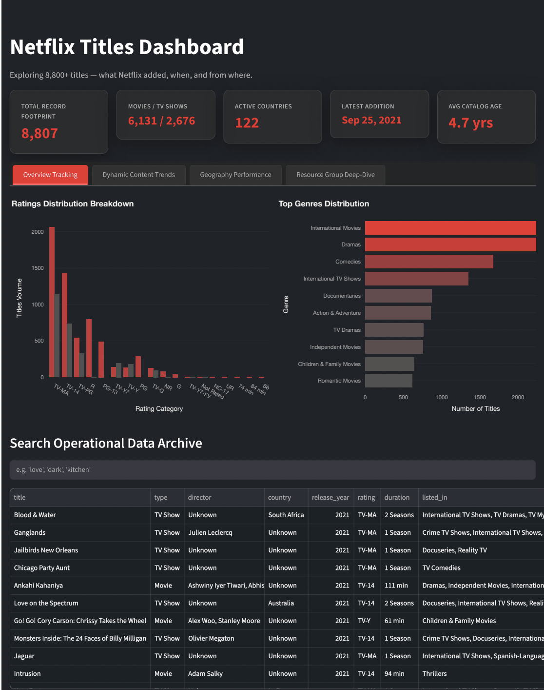
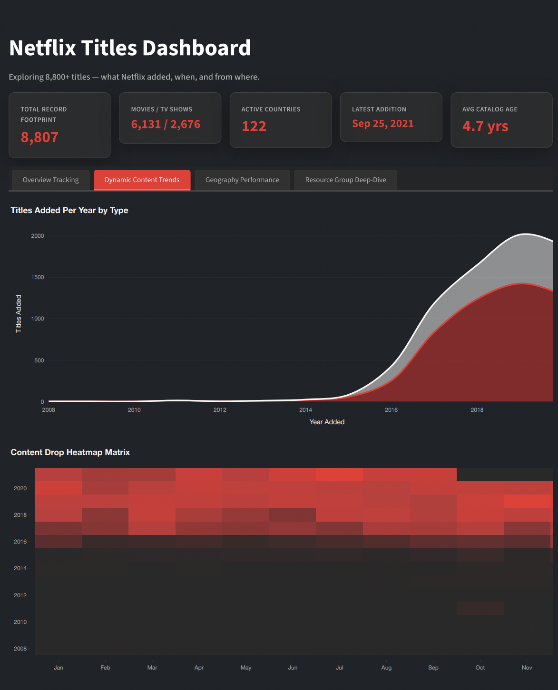
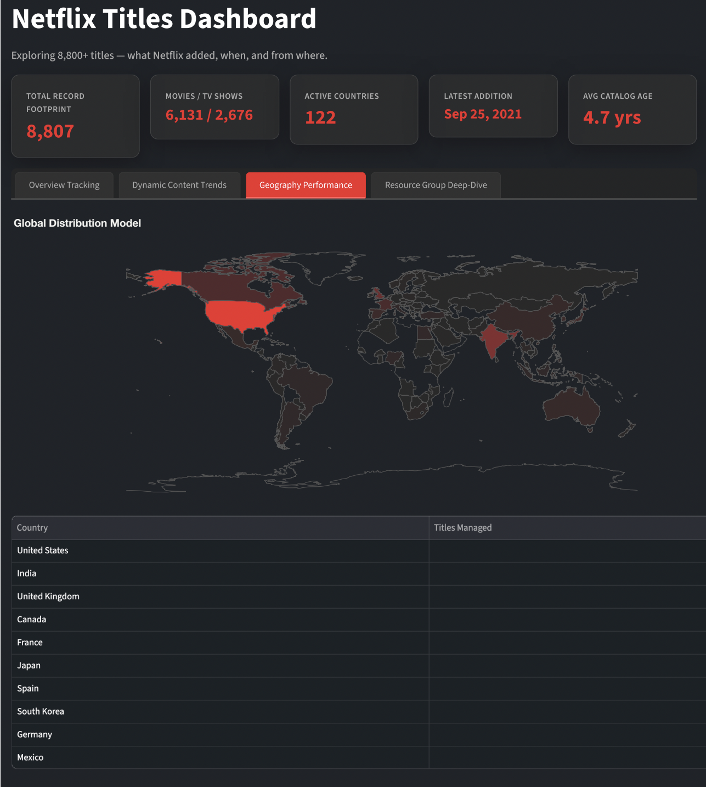
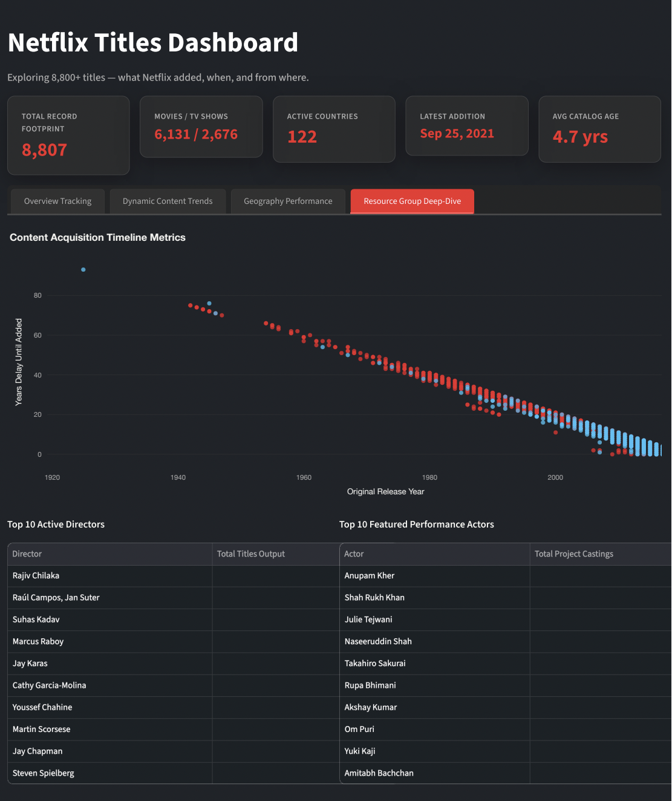

# Netflix Titles Dashboard

An interactive, premium dark-themed web application built with Streamlit and Plotly to analyze over 8,800 Netflix movies and TV shows. This dashboard tracks content additions, catalog age gaps, genres, ratings, and global production distributions.

## Live Application

The dashboard is deployed live on the web and updates automatically. You can access the live system here:
👉 **[Live Netflix Titles Dashboard Deployment](https://netflix-app-dashboard-suaf9n7nf7x5gal4szqvly.streamlit.app)**

---

## Workspace Interface Previews

### 1. Overview Tracking Panel
Displays high-level operational KPIs (8,807 unique total records) alongside content ratings distributions, top genre breakdowns, and a completely searchable operational data archive table.

  

### 2. Dynamic Content Trends Panel
Features custom area timelines tracking content drop frequencies by year alongside an interactive month-vs-year catalog drop heatmap matrix.

  

### 3. Geography Performance Panel
Provides an interactive global choropleth map plotting total catalog contributions by country alongside an automated top 10 global producers index table.

  

### 4. Resource Group Deep-Dive Panel
Includes scatter tracking plots for original release timelines versus platform acquisition delay metrics, alongside automated ranking frames for the top 10 active directors and featured actors.

  

---

## Interactive Analytical Features

* **Global Sidebar Filters:** Allows dynamic multi-value filtering by Type, Country, Genre, Rating, and Release Year Range that automatically recalculates every chart and card on the dashboard simultaneously.
* **Searchable Archive:** An integrated interactive operational data table matching structural parameters dynamically via string query patterns.
* **Acquisition Metrics:** Automated delay computations tracing differences between original theatrical window release years and cloud server deployment timestamps.

## Tech Stack

* **Frontend Framework:** Streamlit (Python)
* **Data Processing & Analytics:** Pandas, NumPy
* **Data Visualization:** Plotly Express, Plotly Graph Objects
* **Styling Integration:** Custom CSS injections for floating card containers and structured typography contrast.
